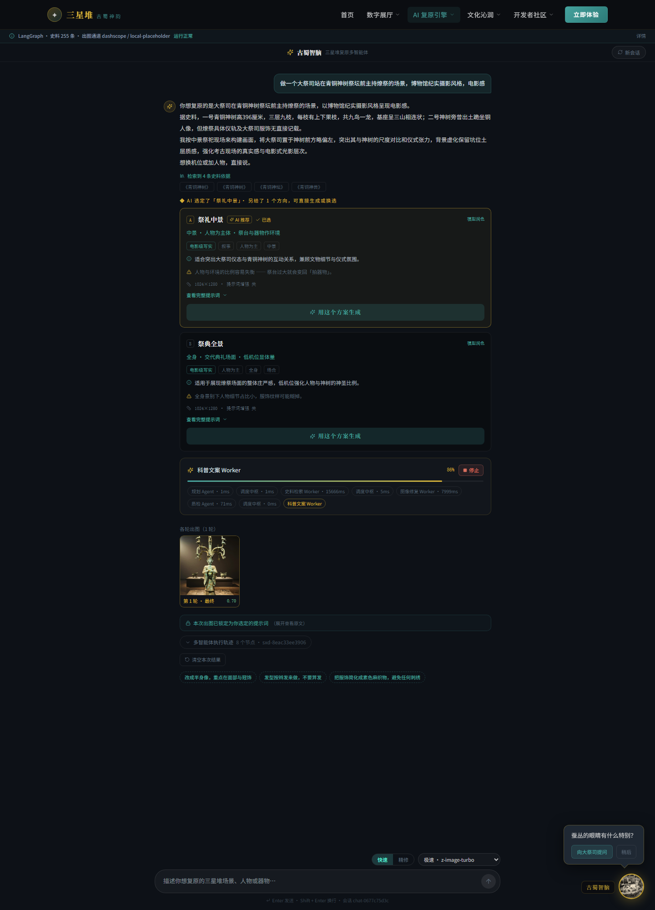
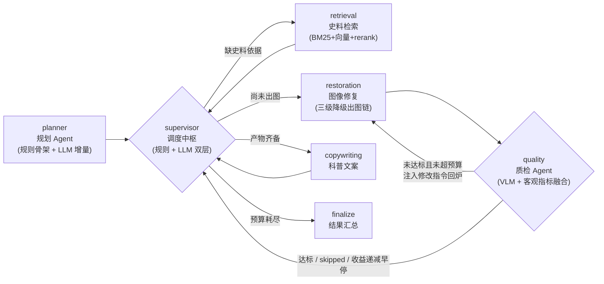
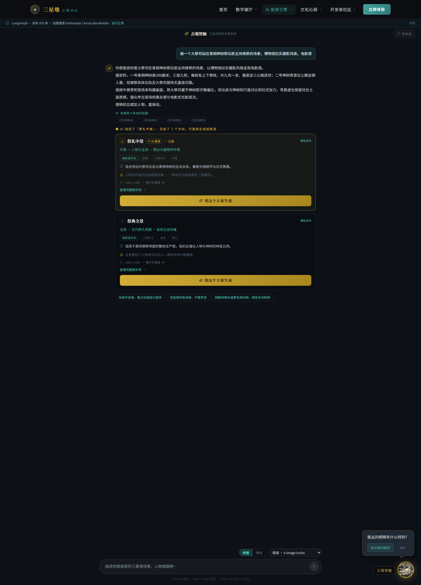

# 三星堆文物复原 Multi-Agent 系统


> **接手开发前请先读 [`docs/HANDOFF.md`](docs/HANDOFF.md)。**
> 那里有：当前进度与已验证状态、**已修复的「回炉无效」Bug 及其实测根因**、
> 剩余任务清单、本机环境踩坑（端口 / 代理 / PowerShell）、需要配置的环境变量，
> 以及一份持续追加的工作日志。

基于 **LangGraph** 的 Supervisor / Worker 多智能体协作系统，面向三星堆文物的
**场景复原 / 人物还原 / 文物修复 / 风格迁移** 四类任务。

用户用一句自然语言描述需求 → 规划 Agent 检索史料并给出多个**候选提示词方案** →
用户选定或改写其中一份 → 图像修复 Worker 严格按该提示词出图 →
质检 Agent 校验风格一致性，不达标自动回炉重做（**Self-Correction**）。

**一次真实运行的全过程**（Agent 轨迹时间线 + 逐轮复原记录 + 最终成品）：



## 目录

- [快速开始](#快速开始)
- [系统总览](#系统总览)
- [无 Key 也能跑](#无-key-也能跑)
- [关键设计决策](#关键设计决策)
- [可观测性与评估](#可观测性与评估)
- [延伸阅读](#延伸阅读)

---

## 系统总览

**编排拓扑**：Supervisor 只做调度不做执行；`quality → restoration` 构成回炉环，
回炉预算（轮次 + 收益递减）由质检 Agent 单方面决定，Supervisor 无权越过：



**两段式交互**：先对话选提示词（花钱前可干预），再确定性出图（选定即逐字锁定）。
下面两张截图分别对应两段 —— 同一次会话，先在 4 个候选方案里做选择，再看着 Agent
逐步执行并交付成品：

| ① 对话层：候选提示词方案（含选题理由 `rationale` 与风险 `risk`） | ② 复原层：Agent 轨迹 + 成品 |
|---|---|
|  |  |

---

## 目录结构：前后端分离

```
SanXIngDui/
├── start.cmd          一条命令启动前后端（双击即可；包装 start.ps1）
├── start.ps1          启动逻辑（预检 → 起后端 → 等健康 → 起前端）
├── frontend/          前端：React 18 + Vite 6 + TypeScript（单栏对话式界面）
│   ├── src/           应用源码
│   ├── public/        静态资源
│   ├── server.mjs     生产环境静态服务 + 反向代理（含 SSE 透传）
│   ├── vite.config.ts 开发服务器与 /agent 代理配置
│   ├── tsconfig.json  严格类型检查
│   └── package.json
│
├── backend/           后端：Python 3.11+ / FastAPI / LangGraph
│   ├── app/           服务源码（按职责分层，见 backend/README.md）
│   ├── data/corpus/   史料语料（v2 · 266 条，JSONL，含出处与可信度分级）
│   ├── migrations/    Alembic 迁移（任务 / 产物 / 质检 / 向量表）
│   ├── training/      QLoRA 微调管线（数据准备 / 训练 / 推理）
│   ├── scripts/       自检与诊断脚本（含后端启动脚本 run.ps1）
│   ├── start.cmd      转发到根目录 start.cmd（停在 backend/ 下也能一条命令启动）
│   ├── tests/         314 个测试（14 个文件）
│   └── requirements.txt
│
├── docs/              设计文档（存储 / 模型选型 / 降级策略）与 HANDOFF.md 交接文档
└── guidelines/        项目规范
```

**两个目录各自独立**：各有自己的依赖清单、环境变量文件、启动命令与 README。
前端不直接持有任何模型 Key —— 所有模型调用都发生在后端，前端只访问 `/agent` 前缀。

---

## 快速开始

### 0) 一条命令启动前后端（推荐）

**配置好一次之后，日常启动就这一条**（在项目根目录 `SanXIngDui/` 下）：

```powershell
.\start.cmd
```

也可以直接**双击** `start.cmd`。它内部以 `-ExecutionPolicy Bypass` 调用 `start.ps1`，
所以**不需要**修改系统的 PowerShell 执行策略；参数原样透传：

```powershell
.\start.cmd -Reload             # 后端热重载
.\start.cmd -BackendPort 8124   # 换端口（前端代理自动跟随）
.\start.cmd -CheckOnly          # 干跑：只预检，不启动任何进程
```

> **目录无所谓**：根目录有 `start.cmd`，`backend\` 下另有一个**转发器**指向它，
> 所以不管你停在项目根目录还是 `backend\`，`.\start.cmd` 都能用。
>
> 在 **cmd** 里写 `start.cmd`（`start` 是 cmd 的内置命令，含义是"新开一个窗口"）；
> 在 **PowerShell** 里写 `.\start.cmd`。

`start.ps1` 会依次：预检 `python / node / npm` 与依赖 → 后台起后端并等 `/api/health` 就绪 →
前台起前端（**Ctrl+C 同时停掉两者**）。常用参数：

| 参数 | 默认 | 作用 |
|---|---|---|
| `-BackendPort` / `-FrontendPort` | `8123` / `5173` | 端口；前端代理会自动跟随 `-BackendPort` |
| `-Reload` | 关 | 后端热重载 |
| `-CheckOnly` | 关 | 只做预检并打印将访问的地址，**不启动任何进程** |
| `-NoBackend` / `-NoFrontend` | 关 | 只起另一端 |

两条防呆规则（都来自真实踩坑）：

- 后端端口上**已经**跑着本项目后端（`/api/health` 通）→ **复用它**，不再另起一个。
  同时存在两个后端时，前端很容易连上旧代码、表现出莫名其妙的 bug（见 `docs/HANDOFF.md`）。
- 端口被**别的进程**占用且不答 `/api/health` → 直接报错退出，**不会乱杀别人的进程**。

后端日志写在 `backend/var/dev.backend.out.log` / `.err.log`。

> 仅适用于 Windows / PowerShell。下面两条是**手动分别启动**的方式（macOS / Linux，或只想单起一端时用）。

### 1) 启动后端

```bash
cd backend

# 安装依赖（FastAPI / LangGraph / httpx / numpy / Pillow / SQLAlchemy / asyncpg / pgvector / redis）
pip install -r requirements.txt

# 可选：配置模型 Key。不配也能启动，系统会自动降级并如实标注
cp .env.example .env        # 然后填入 DASHSCOPE_API_KEY

# 可选：接入真实的 PostgreSQL + pgvector + Redis（详见 docs/STORAGE.md）
python scripts/setup_postgres.py    # 本机没有 PostgreSQL 也能装（免安装发行版）
python scripts/migrate.py           # 建表 + HNSW 向量索引

python -m uvicorn app.main:app --host 127.0.0.1 --port 8123

# 或：一条命令启动（Windows PowerShell，带依赖与配置预检）
powershell -ExecutionPolicy Bypass -File scripts/run.ps1
```

- 接口文档：<http://127.0.0.1:8123/docs>
- 健康自检：<http://127.0.0.1:8123/api/health>（引擎、语料、出图通道、代理诊断、**存储三层实际档位**）

> **启动脚本 `backend/scripts/run.ps1`**（仅 Windows，需 PowerShell）：
> 参数 `-Port`（默认 `8123`）、`-BindHost`（默认 `127.0.0.1`）、`-Reload`（热重载）、
> `-Force`（先停掉该端口上已在跑的**本项目**后端再重启）。
> 它会先预检 `fastapi / uvicorn / pydantic_settings / httpx / numpy / PIL`，并提示
> 可选的 `langgraph` 与 `backend/.env` 是否缺失 —— **只报告、不自动安装**，避免污染你的 Python 环境。
>
> ```powershell
> # 换端口 + 热重载
> powershell -ExecutionPolicy Bypass -File scripts/run.ps1 -Port 9000 -Reload
> ```
>
> **默认端口 8123** 已统一在三处：后端 `run.ps1` / `app/core/config.py`、前端 dev 与生产代理、
> `frontend/.env.example` —— 因此默认**不需要**手动设 `AGENT_BACKEND_URL`；换端口时前后端要一起改。
> （本机的 8000 归另一个项目，指过去会「页面能打开、但每个接口都 404」。）
>
> 前端**没有单独的启动脚本**；要前后端一起启动，用上面的 `start.ps1`。

> 存储是可选的：不配 `DATABASE_URL` / `REDIS_URL` 时，任务不落库、语料向量走进程内、
> 会话存在进程内，**功能全都能跑通**。但一旦配上，`/api/health` 会如实报告它到底连上没有 ——
> 不允许「配了却连不上」被静默吞掉。

### 2) 启动前端

```bash
cd frontend

npm install
cp .env.example .env.local   # 可选，默认已指向 http://127.0.0.1:8123
npm run dev                  # → http://127.0.0.1:5173
```

生产构建与托管：

```bash
npm run build                # 先 tsc 类型检查，再 vite build
npm start                    # 用 server.mjs 托管 dist/ 并代理 /agent
```

自检：

```bash
npm run typecheck            # 类型检查（测试文件也已纳入）
npm test                     # 组件与接口封装测试（vitest + jsdom，离线、秒级）
```

---

## 无 Key 也能跑

系统对每一层依赖都有明确降级路径，并把降级事实**如实标注**，而不是静默返回次品：

| 缺失项 | 系统行为 |
|---|---|
| 未配置 `DASHSCOPE_API_KEY` | 对话 / 文案降级为规则与模板实现；检索降级为 BM25 + 本地哈希向量；**出图落到第三方免鉴权通道（真实图片，带水印）** |
| 出图通道全部不可用 | 输出**明确标注的本地占位示意图**；质检标记为 `skipped`（未质检）且不触发回炉 —— 对一张示意图做风格打分没有可判定的对象 |
| `langgraph` 未安装 | 自动切到内置 DAG 调度器（节点函数、路由规则、状态合并语义完全一致） |
| 未配置 `DATABASE_URL` | 任务 / 产物 / 质检记录不落库（只留 JSONL trace）；语料向量走进程内 numpy 暴力检索 —— **召回质量不变，但重启要重新算一遍向量** |
| 未配置 `REDIS_URL` | 会话退回进程内 TTL 存储；单机行为一致，但多副本部署会丢上下文、滚动重启会打断对话 |

关键原则：**宁可如实说「这次是降级结果」，也不要静默返回一个看起来正常的次品。**

---

## 关键设计决策

**1. 对话选提示词 → 确定性出图，两段式**

单纯「文字 → 图片」是一条无法干预的黑盒。拆成两段后，用户在花钱出图之前就能看到
「Agent 打算怎么画、依据是什么史料、风险在哪」，而且改写提示词能**逐字生效**
（选定方案一律关闭模型的提示词增强，否则锁定契约会被架空）。

**2. 材质是独立维度，不属于「摄影风格」**

风格档案描述「怎么拍」，材质描述「拍的是什么」。把两者混在一起会产出
`hammered gold foil ... matte oxidized bronze with dense granular patina`
这种自相矛盾的提示词，也会让质检拿青铜的色域标准去要求黄金面具，
进而把「补足锈绿」注入回炉提示词 —— 等于用质检把黄金主动改成青铜。

**3. 质检不是「再调一次模型打分」**

出图用的是扩散模型，质检用的是**判别式 VLM + 确定性图像统计**融合：
客观指标（饱和度 / 近白高光占比 / 色彩家族分布 / 边缘密度 / 平坦区占比）不会幻觉，
VLM 负责客观指标测不到的形制与时代合规。两者冲突时以客观指标兜底，
时代错配一票否决（分数封顶 0.40）。

```text
score = 0.6 × VLM五维加权 + 0.4 × 客观指标      # VLM 不可用时退化为纯客观
        客观分 < 0.5 → score = min(score, (obj+judge)/2)   # 防 VLM 幻觉放水
        时代错配     → score 封顶 0.40（一票否决，并记录 capped_by）
回炉预算 = max_revisions 2 次硬上限 + 收益递减早停（Δscore < 0.02 即停）
```

回炉环的完整拓扑见上文[系统总览](#系统总览)；「为什么回炉曾经过无效、如何实测定位」
见 [`docs/HANDOFF.md`](docs/HANDOFF.md)。

---

## 可观测性与评估

- `GET /api/metrics` —— 风格错配率、平均回炉次数、降级比例（进程内计数器）
- `GET /api/stats/quality` —— 同样的指标，但来自 **SQL 聚合**：跨重启累计，口径以落库的任务行为准
- `GET /api/tasks` / `GET /api/tasks/{task_id}` —— 历史任务列表与逐轮明细（每轮的提示词、分数、修改指令）
- `GET /api/traces/{task_id}` —— 该任务完整的 JSONL 轨迹（每个 Agent 的输入输出与耗时）
- `GET /api/models` —— 模型选型矩阵，含每个角色的选型理由与降级链
- `POST /api/eval/run` —— 跑风格错配率基准（单次调用基线 vs 多智能体全链路对照）

后端自检脚本（均在 `backend/scripts/`）：

```bash
python scripts/smoke_test.py          # 离线端到端，不依赖任何 Key
python scripts/probe_chat.py          # 对话链路 SSE 端到端（需先启动服务）
python scripts/check_materials.py     # 材质链路校验
python scripts/check_revision_effect.py  # 验证回炉是否真的改变了模型输入与输出
```

---

## 延伸阅读

- [docs/QA_CHECKLIST.md](docs/QA_CHECKLIST.md) —— **动手自测清单**：环境状态、起停命令、建议自测顺序、哪些现象不是 bug
- [backend/README.md](backend/README.md) —— 后端架构、接口清单、设计说明
- [frontend/README.md](frontend/README.md) —— 前端结构与交互设计
- [docs/STORAGE.md](docs/STORAGE.md) —— 存储层设计：PostgreSQL + pgvector + Redis，含实测数据与已知边界
- [docs/MODEL_SELECTION.md](docs/MODEL_SELECTION.md) —— 模型选型依据与完整降级矩阵
- [backend/training/README.md](backend/training/README.md) —— QLoRA 微调流程
