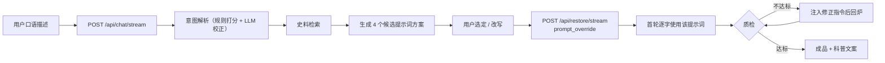

# 三星堆文物复原 · Multi-Agent 服务

基于 **LangGraph** 的 Supervisor/Worker 多智能体系统：规划 Agent 把复原目标拆解为
可执行子任务并调度，下辖**史料检索 / 图像修复 / 科普文案** 三个 Worker，
末端由**质检 Agent** 校验修复图的风格一致性，不达标自动回炉（Self-Correction）。

```
                        ┌──────────────┐
   HTTP/SSE ──────────► │   planner    │  拆解目标：检索 query / 图像 prompt /
                        │  规划 Agent   │  风格约束 / 验收标准
                        └──────┬───────┘
                               ▼
                     ┌───────────────────┐
        ┌───────────►│    supervisor     │◄──────────────┐
        │            │    调度中枢        │               │
        │            └────┬─────┬────┬───┘               │
        │                 │     │    │                   │
        │                 ▼     │    ▼                   │
        │        ┌────────────┐ │ ┌──────────────┐       │
        │        │ retrieval  │ │ │ copywriting  │       │
        │        │ 史料检索    │ │ │ 科普文案      │       │
        │        └─────┬──────┘ │ └──────┬───────┘       │
        │              │        ▼        │               │
        │              │  ┌────────────┐ │               │
        │              │  │restoration │ │               │
        │              │  │ 图像修复    │ │               │
        │              │  └─────┬──────┘ │               │
        │              │        ▼        │               │
        │              │  ┌────────────┐ │               │
        │              └──┤ quality    ├─┘               │
        │  补充检索        │ 质检 Agent  │   通过           │
        └─────────────────┤            ├───────────────►│
              (依据不足时)  └─────┬──────┘  未达标回炉
                                 │  ────────────────────┘
                                 ▼
                            ┌──────────┐
                            │ finalize │
                            └──────────┘
```

---

## 快速开始

```bash
cd backend

# 1) 安装依赖（全部为轻量纯 Python 包）
python -m pip install -r requirements.txt

# 2) 配置（可选。不配也能跑，只是效果受限且会被如实标注）
cp .env.example .env          # Windows: Copy-Item .env.example .env
# 在 .env 中填入 DASHSCOPE_API_KEY

# 3) 启动（默认 8123 —— 本机 8000 被另一个项目占用）
python -m uvicorn app.main:app --host 127.0.0.1 --port 8123

# 或使用带环境自检的脚本（Windows）
powershell -ExecutionPolicy Bypass -File scripts/run.ps1 -Port 8123
```

启动后：

- 接口文档：<http://127.0.0.1:8123/docs>
- 健康自检：<http://127.0.0.1:8123/api/health>（会报告引擎、语料、出图通道、代理诊断）
- 模型选型矩阵：<http://127.0.0.1:8123/api/models>

> ⚠️ 默认端口是 **8123**：`run.ps1`、`app/core/config.py`、前端代理默认值三处保持一致。
> 要换端口就一起改 —— 后端 `-Port`（或 `BACKEND_PORT`）与前端 `AGENT_BACKEND_URL`。

### 自检路径

```bash
# 不依赖任何 API Key 的端到端自检（推荐先跑这个）
python scripts/smoke_test.py

# 真实存储栈自检（PostgreSQL + pgvector + Redis，38 项断言）
python scripts/check_storage.py

# SSE 帧协议自检（检查前端依赖的帧格式与事件序列）
python scripts/sse_probe.py --base http://127.0.0.1:8123

# 对话层端到端自检（多轮 SSE + 提案 + 提示词锁定 + 风格档案）
python scripts/probe_chat.py            # 需先启动服务
python scripts/check_conversation.py    # 离线，只测意图理解

# 单元测试（219 个用例，覆盖路由/质检/检索/接口/SSE/对话/材质/出图通道/会话存储/向量复用判定）
python -m pytest tests -q
```

> 测试是**离线**的：`tests/conftest.py` 里有 autouse fixture 会关掉
> freeimage / dashscope，并且把 `DATABASE_URL` / `REDIS_URL` 清空。
> 不关的话默认开启的第三方出图通道会让测试真打公网（从 4 秒变成 4 分钟），
> 而真实数据库会被测试数据写脏。
>
> **代价要说清楚**：真实存储链路因此没有任何单测覆盖，
> 它由 `scripts/check_storage.py` 显式验证 —— 与 `app/eval/harness.py`
> 对真实出图链路的处理方式一致：显式执行，不靠隐式副作用。

---

## 交互模型：先对话选提示词，再确定性出图

这是两段式设计，因为「想清楚要什么」和「把它画出来」是两类不同的问题：



**为什么要拆成两段**：单纯的「文字 → 图片」是一条无法干预的黑盒。
拆完之后，用户在花钱出图之前就能看到「Agent 打算怎么画、依据是什么史料、风险在哪」，
而且改写提示词能**逐字生效**。

### `POST /api/chat/stream` — 对话层（SSE）

```json
{ "message": "做一个大祭司站在青铜神树祭坛前的场景", "session_id": null }
```

帧序列（顺序固定，前端依赖它渲染流式光标）：

| event | 载荷 | 说明 |
|---|---|---|
| `session` | `{session_id, turns}` | 第一个发，多轮对话靠它延续 |
| `intent` | `{kind, subject, identity, scene, style_preset, brief}` + `mode` | 意图解析结果。`mode=rule` 表示无 Key 时的规则实现 |
| `evidence` | `[{doc_id, title, text, score}]` | 作为提示词依据的史料 |
| `delta` | `{text}` × N | 回复正文的流式片段 |
| `proposals` | `{items: [...], count: 4}` | 候选提示词方案（见下） |
| `message` | `{text}` | 回复全文（流式结束后的完整版） |
| `followups` | `["..."]` | 3 条自然的追问建议 |
| `trace` | Agent 轨迹 | 与复原链路共用同一套事件 |
| `: ping` | — | 心跳（15s） |

每个 proposal 的字段：

```json
{
  "id": "scene:documentary", "strategy": "documentary", "title": "展陈纪实",
  "style_profile": "archival", "style_label": "考古档案照片",
  "prompt": "...", "negative_prompt": "...",
  "rationale": "为什么这么拍", "risk": "这一版可能在哪里翻车",
  "tags": ["稳妥", "全器"],
  "params": {"width":1024,"height":1280,"style_strength":null,"prompt_extend":false},
  "evidence_ids": ["sxd-tree-01"]
}
```

`rationale` 与 `risk` 是刻意要求模型产出的：只给提示词的话，用户没办法判断该选哪个。

### `prompt_override` — 「确定不出图」的契约

选中某个方案（或手改完提示词）后，把它原文放进 `prompt_override`：

```json
{
  "kind": "scene",
  "prompt": "口语描述，仍会走检索",
  "plan": {"profile_key": "..."},
  "prompt_override": {
    "prompt": "<选定的提示词，逐字使用>",
    "profile_key": "archival",
    "width": 1024, "height": 1280, "prompt_extend": false,
    "proposal_id": "scene:documentary", "proposal_title": "展陈纪实"
  }
}
```

配套行为：

- `plan.image_spec.source = "user_selected_proposal"`，并在 `style_constraints` 里写入
  「不得自动改写」；
- **首轮逐字下发**（`_compose_prompt` 遇到 `prompt_locked` 且 `revision==0` 直接返回原文）；
- **回炉轮次仍会追加质检的修正指令** —— 锁定的是「基准」，不是「Self-Correction」；
- 形制要点（`locked_form_notes`）不从用户提示词推导，而仍从文物词典取：
  提示词可以改，**质检标准不能跟着改**。

### `POST /api/restore/stream` — SSE 流式复原（出图段）

请求体（四个 Tab 共用一套扁平结构，`kind` 决定 Planner 的解析分支）：

```json
{
  "kind": "scene",
  "identity": "大祭司",
  "scene": "博物馆展厅",
  "item": "青铜纵目面具",
  "style": "博物馆纪实摄影",
  "seed": 20260916,
  "reference_images": [],
  "max_revisions": 2
}
```

响应为 `text/event-stream`，帧类型：

| event | 说明 |
|---|---|
| `start` | 任务已受理（task_id / engine / 回炉预算） |
| `node` | 某个图节点完成：进度、耗时、增量结果摘要 |
| `trace` | 细粒度 Agent 轨迹：`plan_ready` / `retrieval_ready` / `image_ready` / `qa_verdict` / `degraded` / `llm_call` / `copy_delta` … |
| `done` | 最终结果（含 image / qa / copy / evidence / plan / timeline / usage） |
| `error` | 任务级失败 |
| `: ping` | 心跳注释帧（15s），防中间层断连 |

### 其他端点

| 方法 | 路径 | 说明 |
|---|---|---|
| POST | `/api/chat/stream` | 对话层流式（意图 + 史料 + 回复 + 候选提示词方案） |
| GET | `/api/chat/session/{id}` | 取会话历史（用于刷新页面后恢复） |
| POST | `/api/chat/reset` | 重置会话 |
| GET | `/api/chat/stats` | 会话数、淘汰数、各 kind 的策略数 |
| POST | `/api/restore` | 同步版本（评估脚本 / 调试 / 不支持 SSE 的客户端） |
| GET | `/api/health` | 引擎、语料、出图通道、模型配置、代理诊断 |
| GET | `/api/models` | 模型选型矩阵（含每个角色的选型理由与成本/延迟提示） |
| GET | `/api/graph` | 图拓扑、回炉上限、风格阈值、引擎回退原因 |
| GET | `/api/styles` | 风格档案（客观阈值 + VLM 评分细则） |
| GET | `/api/corpus` | 语料规模与字段取值集合 |
| POST | `/api/corpus/reload` | 语料热更新（改完 jsonl 不用重启） |
| GET | `/api/metrics` | 指标快照（含风格错配率、回炉次数、降级次数） |
| GET | `/api/traces/{task_id}` | 该任务的完整 JSONL 轨迹 |
| POST | `/api/eval/run` | 跑风格错配率基准 |
| GET | `/api/tasks` | 历史任务列表（来自 PostgreSQL，可按 `kind` / `decision` / `passed` / `item` 过滤） |
| GET | `/api/tasks/{task_id}` | 任务详情：逐轮出图（含实际下发的 prompt）与逐轮质检判定 |
| GET | `/api/stats/quality` | 质量统计（SQL 聚合）：通过率 / 平均分 / 平均回炉次数，按任务类型分组 |

---

## 目录结构

```
backend/
├── app/
│   ├── core/           基础设施：配置 / 日志 / 错误 / 上下文 / 追踪 / 指标 / 代理规避
│   ├── models/         能力路由：角色→模型→降级链；OpenAI 兼容客户端；本地 QLoRA 推理
│   ├── rag/            检索：BM25（纯 Python）+ 向量混合 + Cross-Encoder 重排
│   ├── imagegen/       出图：DashScope 千问图像 / 第三方免鉴权 / 本地占位（三级降级）
│   ├── quality/        质检：风格档案 + 确定性图像统计 + VLM 裁判融合
│   ├── agents/         五个 Agent 与文物词典
│   ├── graph/          状态定义 / 节点封装 / 条件路由 / 引擎装配 / 任务执行器
│   ├── storage/        持久化：PostgreSQL 连接 / 关系模型 / 任务仓储 / 会话存储 / 向量索引
│   ├── api/            HTTP 接口与 SSE
│   ├── eval/           风格错配率基准
│   └── main.py         FastAPI 入口
├── data/corpus/        史料语料（JSONL，可直接替换为你自己的史料库）
├── migrations/         Alembic 迁移（初始 4 张表 + HNSW 索引）
├── training/           QLoRA 数据管线 / 训练 / 推理验证
├── tests/              单元测试 + 接口端到端测试
├── scripts/            启动、冒烟、存储自检、SSE 探针、数据库迁移
└── var/                运行产物（归档图 / 轨迹 / 指标 / 评估报告，已在 .gitignore 中）
```

---

## 一些值得单独说明的设计

### 为什么「质检」不是简单调一次模型

风格一致性被拆成两把尺子：

1. **确定性图像统计**（`quality/objective.py`）：饱和度区间、近白高光占比、
   色彩家族分布、边缘密度、平坦区占比。**可复现**，抓得住 Diffusion 最典型的塌方
   （荧光色、新铜般的镜面高光、塑料感）。
2. **VLM 裁判**：负责前者做不到的部分 —— 时代错配识别、形制忠实度、纹饰合理性。

融合时 VLM 权重更高（0.6），但客观指标塌方时用 `min()` 兜底防幻觉放水；
**时代错配一票否决**（分数封顶 0.40），不给「其他维度都不错可以放过」的空间。

### 为什么回炉能真的改变结果

质检输出的 `feedback` 不是「不合格，重做」，而是可直接转成 prompt 的修改指令
（「把镜面高光降下来」「补足锈绿占比」「移除铁器元素」）。
图像修复 Worker 会把这批指令、参考图残损报告、史料视觉线索与规划骨架
四路信息合成新的 prompt —— 否则回炉只会得到同一张图。

### 但「写进 prompt」不等于「模型看得见」：实测有效窗口

第三方免费出图通道**不读完整提示词**。它有一个有效窗口，窗口之外的文字不报错，
只是**静默消失** —— 而回炉指令原本正写在最末尾，于是「回炉了但画面逐像素不变、
质检分数一模一样」，看起来像模型能力不行。

用 `scripts/probe_freeimage_tail.py` 做对照实验：构造两个头部完全相同、只差一句
色调描述的提示词，分别出图后**逐像素**比较。

| 提示词长度 | 差异放在**尾部** | 差异放在**开头** |
|---|---|---|
| 288 字 | 生效（81.7% 像素不同） | — |
| 584 字 | **0 个像素不同**（最大像素差 0） | 生效（99.9% 像素不同） |
| 732 字 | **0 个像素不同** | — |

「把差异挪到开头就生效」这一条，同时排除了「上游按提示词整体缓存」的解释：
这是**位置**问题，不是缓存问题。

据此定下两条硬约束，都写进了代码注释与单测：

1. **修正指令前置**（`agents/restoration_worker.py::_compose_prompt`）：`revision > 0` 时
   整段指令排在最开头，且引导语压到 40 字以内 —— 保证模型一定读得到「要改什么」，
   而不是只看到一句 `apply:`。第 0 轮 `prompt_locked` 逐字下发的契约不受影响。
2. **预算取实测窗口以下的保守值**（`freeimage_max_prompt_chars = 256`）：窗口边界按
   token 计、随内容浮动，字符数只是近似，所以必须留余量；**调大预算不会让模型看到更多**，
   只会让超窗的部分悄悄丢掉。

回归验证用 `scripts/check_revision_effect.py`：它比较**像素**而不是文件字节
（早期版本比字节，输出过假 PASS —— 上游重新编码同一张图，字节不同、像素全同），
并检查修正指令是否落在下发内容的头部窗口内。

### 为什么任务要落库（而不是只留 JSONL trace）

在这之前，一次复原任务跑完只留下三样东西：`var/traces/*.jsonl`（给人看的轨迹）、
`var/metrics/metrics_snapshot.json`（进程内计数器的快照）、`var/outputs/*.png`。

结果是「上周那批青铜面具平均回炉几次、哪类器物通过率最低」这类问题**没法用 SQL 回答**，
只能写脚本扒 JSONL —— 而这些恰恰是评估一个多智能体系统最该回答的问题。
所以四张表：

| 表 | 一行代表 | 它让哪个问题变得可查询 |
|---|---|---|
| `restoration_tasks` | 一次复原任务 | 通过率 / 平均分 / 平均回炉次数（跨重启累计） |
| `task_images` | 一轮出图 | 这张图是用**哪份提示词**、哪个 provider、什么尺寸生成的 |
| `qa_verdicts` | 一轮质检 | 每轮的修改指令是什么、分数怎么变化的 |
| `corpus_chunks` | 一条史料 + 向量 | 换了 embedding 模型后，哪些向量已经失效 |

三个不做 demo 的细节：

1. **逐轮落库，不是任务结束一次性写。** 回炉是逐轮的（第 2 轮跑完时第 1 轮的分必须可查），
   而且**钱已经花了** —— 任务中途崩溃时前面几轮的记录必须留下。
2. **向量复用。** 向量是语料派生的缓存，重建要真金白银调模型。持久化之后重启直接复用：
   `史料语料: 50 条（向量通道: pgvector，复用 50 / 新算 0）`。
3. **降级如实上报。** 连不上数据库不阻断启动，但 `/api/health.storage` 会给出**原始异常**，
   而不是静默降级成「看起来一切正常」。

完整设计取舍、部署步骤与实测数据见 [`../docs/STORAGE.md`](../docs/STORAGE.md)。

### 为什么有两套编排引擎

`LangGraphOrchestrator` 是默认引擎；`BuiltinOrchestrator` 是内置 DAG 调度器，
与前者共享**完全相同的节点函数、路由规则与状态合并语义**。
保留第二套是因为真实环境里 `pip install langgraph` 未必成功
（私有源缺包、网络受限、Python 版本不匹配）。此时切 `ENGINE_BACKEND=builtin`
系统依然完整可用 —— 框架是手段，不是目的。两者的行为一致性由
`tests/test_routing.py::test_merge_matches_langgraph_reducer_semantics` 守住。

### 为什么把出图参数从 steps/cfg/LoRA 改成「尺寸 + 风格强度」

`steps` / `cfg` / `sampler` / `lora_strength` 是**扩散采样器**的旋钮，
只有 ComfyUI 那条链路才消费它们。本项目采用纯代码（API）出图后，
这些参数一个都不会被下发 —— 而界面与接口上却照旧写着
「steps 32 · cfg 6 · LoRA 0.85」，等于向用户展示一组不生效的假旋钮。

而「风格强度」这件事本身是真实的：轻/中/强三档现在改为写进**提示词的措辞**
（`ProposalStrategy.strength_phrase()`），是模型真能读懂的指令，
而不是一个它看不懂的 `blend weight 0.75`。

同理，出图请求里保留的只有 API 真正支持的字段：尺寸、seed、参考图，
以及一个容易被忽略但很关键的开关 —— **`prompt_extend` 必须默认关闭**。
我们向用户承诺「逐字使用你选定的提示词」，而百炼的提示词增强默认是**开启**的，
会让模型自行改写提示词，等于把锁定契约和质检标尺一起架空。

---

## 延伸阅读

- [存储层设计：PostgreSQL + pgvector + Redis](../docs/STORAGE.md)
- [模型选型与降级策略](../docs/MODEL_SELECTION.md)
- [QLoRA 微调管线](training/README.md)
